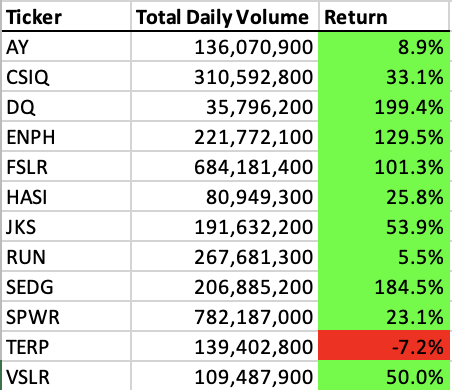
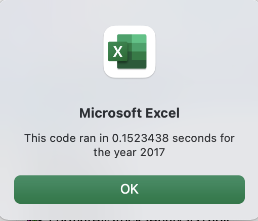
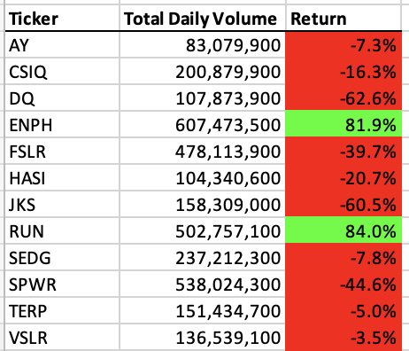
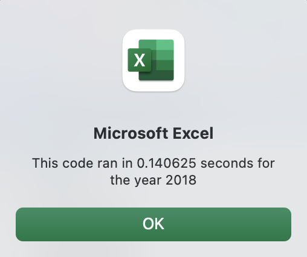

# stocks-analysis
Analysis of stock market performance for selected green energy sector organizations

## Overview of the Project
A colleague, Steve, just graduated from college with an undergraduate degree in finance. Steve’s parents were very happy about his choice of study as they have been avid investors and hoped he might be able to provide some insights from his financial studies.  Of primary interest to Steve’s parents is the green energy sector, specifically the publicly traded organization DAQO New Energy Corp (Ticker: DQ). As they are singularly invested in the DQ stock, Steve’s parents hoped Steve could use is financial analysis skills to investigate the DQ stock performance. In an effort to help his parents Steve agreed to analyze the DQ stock as well as other stocks in the green energy sector. 

### Purpose of this Analysis
The purpose of this analysis was to investigate stock data from the green energy sector.  More specifically the DQ stock performance was analyzed and compared to eleven other stocks in the same sector. 

## Results
After reviewing stock data from 2017 and 2018 the following results were derived. Tables 1 and 2 display the results of the stock data analysis from these years respectively. Figures 1 and two highlight the run times for the algorithm designed to produce the results. In order to assess stock performance in a given year, two calculations were performed. First, the total volume of stock traded was aggregated across the year. Assuming more transactions of more stock units would be an indicator of higher performance, a higher total volume number was considered higher performing.  

The second calculation was the percentage change in stock price from the beginning of the year to the end of the year. Reporting percentage change in stock price controls for differences in year start stock prices, providing a relative metric. Higher positive percentage increases were considered higher performing relative to other stocks. 

For 2017, the highest volume of shares traded was SPWR at 782,187,000 units. By comparison, DQ actually had the lowest volume traded with 35,592,800 units. That being said, DQ stock had the highest return, or percentage increase of value over the year with an increase of 199.4%. TERP had worst performance of the stocks analyzed this year with a -7.2% change. Of the 12 stocks analyzed, 11 stock values increased over the course of 2017. 

Table 1. Stock Comparison 2017

Figure 1.  Stock Report Run Time for 2017

For 2018, the highest volume of shares traded was ENPH at 607,473,500 units. The lowest volume traded was AY at 83,079,900 units. DQ stock traded at a total volume of 107,873,900 units over the year. For returns in 2018, the highest performing organization was RUN with an increase of 84%. DQ was the lowest performing with a -62.6% change in stock value from beginning to end of the year. Many of the other stocks analyzed also dropped with only 2 of the 12 stocks resulting in positive returns for 2018. 

Table 2. Stock Comparison 2018

Figure 2. Stock Report Run Time for 2018

## Analysis
After analyzing the data from stock index performance in 2017 and 2018 the following insights and recommendations are provided. Overall, from a return percentage performance perspective, it appears 2017 was a better year as 11 of the 12 stocks had positive returns whereas in 2018 only 2 of the 12 stocks had positive returns.  Or stock of interest, DQ had a particularly good year in 2017 with a 199% increase in value. Total daily volume data had less prominent trends and more investigation may be needed to derive any meaningful insights. As mentioned, 2018 was overall poorly preforming and DQ decreasing sharply in value (-62.6%). However, the two stocks that did have positive performances in 2018, ENHP (81.9%) and RUN (84.0%) also had positive returns in 2017.  This suggests that there may be some stocks maintaining more consistent positive returns year over year as overall markets fluctuate. It is recommended to investigate performance trends over more years and include more stocks of interest in that investigation. 

## Summary
The following highlights some advantages and disadvantages of refactoring code. Some advantages of refactoring code include improving the organization of the program and optimizing the actual lines of code to make it more efficient. Refactoring also provides an opportunity to clean up the code’s comments, improve explanations in comments, as well as identify bugs. Ideally this will result in faster running and more understandable code.

Despite the advantages of refactoring, some disadvantages may exist as well. Depending on the code, it could be very time consuming and thus costly. If refactoring requires lots of tedious changes and testing to ensure it works properly, the effort could result in a high number of man hours invested in the project.
    

The Original VBA script in this project was refactored and the advantages and disadvantages mentioned here could also apply. One advantage was that code from multiple different VBA modules were consolidated to one block of code.  This allowed for the calculations, conditional applications, and formatting to all happen in the same script. Second, the refactoring effort provided an opportunity to optimize the comments to make the code intentions clearer. On potential disadvantage was that the original script looped through the lines using some variables. In the optimizes code, the variables were changed to arrays. This effort required somewhat tedious changes to many of the code blocks requiring additional testing which ultimately was time consuming. 

